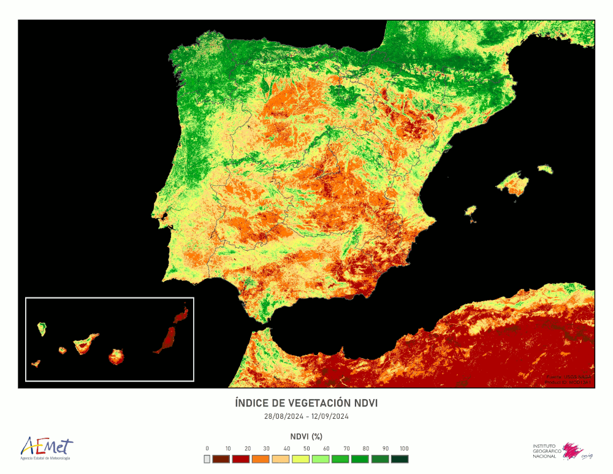
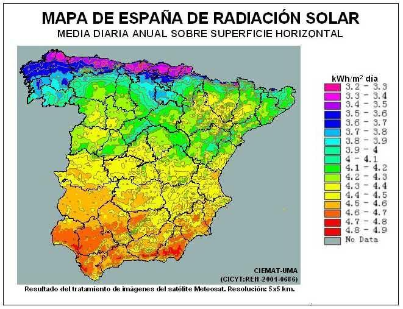

# Índice de contenidos:


# Repositorio

Url del repositorio: https://github.com/alc1020/SEMINARIO_FUENTES 
Participantes: cra1009@alu.ubu.es , stg1004@alu.ubu.es y alc1020@alu.ubu.es

#Resumen

Durante la resolución de este seminario se pretenderá establecer una relación entre los efectos de los rayos ultravioleta, las horas de luz en el día y las zonas verdes en la obtención de cualquier patología dermatológica a nivel nacional.

# Introducción

Las patologías a nivel dermatológico son un problema.

# Objetivo

Los objetivos lo tendremos cuando hagamos el seminario.

# Metodología

Hemos accedido a distintas fuentes de datos para recopilar información acerca de las horas de sol en España por provincias, así como el índice de radiación UV, las áreas verdes y el número de muertes por cáncer de piel.

## 1. Búsqueda de datos. Mapas

### 1.1 Índice anual de enfermedades de piel y subcutáneas por comunidades autónomas
Datos proporcionados por el Instituto Nacional de Estadística que nos indican la cantidad de personas que fallecen debido a patologías cutáneas y subcutáneas anualmente. Están disponibles los datos desde el año 2010 al año 2022.

Para un manejo más eficiente, sólo utilizaremos las del año 2022 en conjunto con los datos aportados por AEMET.

```{r Defunciones-en-2022} 
library(readr)
Defunciones_2022 <- read_delim(file = "INPUT/DATA/defunciones_2022 csv.csv",
                                  delim = ";", escape_double = FALSE, trim_ws = TRUE)
```


### 1.2 Zonas verdes distribuidas por comunidades autónomas
Usando greenR obtenemos datos relevantes a la distribución de zonas verdes del país. Así, accedemos a una serie de ubicaciones representativas de cada provincia, con estos valores realizamos una media para obtener una representación apropiada para cada comunidad autónoma. 

```{r Zonas-Verdes-CCAA}
library(greenR)

vector_provincias <- c("Huelva, Spain", "Sevilla, Spain", "Cordoba, Spain", "Jaen, Spain", "Cadiz, Spain", "Malaga, Spain", "Granada, Spain", "Almeria, Spain", 
                       "Huesca, Spain", "Zaragoza, Spain", "Teruel, Spain", 
                       "Asturias, Spain",
                       "Mallorca, Spain", "Menorca, Spain", 
                       "El hierro, Spain", "Gran Canaria, Spain", "La Gomera, Spain", "La Palma, Spain", "Tenerife, Spain", 
                       "Cantabria, Spain", 
                       "Leon, Spain", "Palencia, Spain", "Burgos, Spain", "Soria, Spain", "Zamora, Spain", "Valladolid, Spain", "Segovia, Spain", "Salamanca, Spain", "Avila, Spain", 
                       "Guadalajara, Spain", "Cuenca, Spain", "Albacete, Spain", "Toledo, Spain", "Ciudad Real, Spain",
                       "Gerona, Spain", "Barcelona, Spain", "Lerida, Spain", "Tarragona, Spain", 
                       "Castellon, Spain", "Valencia, Spain","Alicante, Spain", 
                       "Caceres, Spain", "Badajoz, Spain", 
                       "La Coruña, Spain", "Lugo, Spain", "Pontevedra, Spain", "Orense, Spain",
                       "Madrid, Spain", 
                       "Murcia, Spain",
                       "Navarra, Spain", 
                       "Vizcaya, Spain", "Guipuzcoa, Spain", "Alava, Spain", 
                       "La Rioja, Spain",
                       "Ceuta, Spain", 
                       "Melilla, Spain" 
                       )
vector_relevante <- c("El Rocío, Spain", "La Puebla del Río, Spain", "Hornachuelos, Spain", "Cazorla, Spain", "Grazalema, Spain", "Ronda, Spain", "Capileira, Spain", "Níjar, Spain", 
                      "Torla, Spain", "Añón de Moncayo, Spain", "Tramacastilla, Spain",
                      "Cangas de Onís, Spain", 
                      "Escorca, Spain", "Es Mercadal, Spain", 
                      "Sabinosa, Spain", "Tejeda, Spain", "Hermigua, Spain", "El Paso, Spain", "La Orotava, Spain", 
                      "Potes, Spain", 
                      " Posada de Valdeón, Spain", " Cervera de Pisuerga, Spain", "Covarrubias, Spain", "Ucero, Spain", "Galende, Spain", "Castronuño, Spain", "Sepúlveda, Spain", "La Alberca, Spain", "Hoyos del Espino, Spain", 
                      "Cantalojas, Spain", "Beteta, Spain", "Ossa de Montiel, Spain", "Los Navalucillos, Spain", "Villarrubia de los Ojos, Spain",
                      "Cadaqués, Spain", "Montseny , Spain", "Espot , Spain", "Deltebre, Spain", 
                      "Morella, Spain", "Parque Natural de la Albufera, Spain", "Sierra de Mariola, Spain", 
                      "Torrejón el Rubio, Spain", "Alange , Spain",
                      "Pontedeume, Spain", "Cervantes, Spain", "O Grove, Spain", "Rubiá, Spain", 
                      "Rascafría, Spain", 
                      "Alhama de Murcia, Spain",
                      "Ochagavía, Spain", 
                      "Gernika, Spain", "Oiartzun, Spain", "Arraia-Maeztu, Spain", 
                      "Villoslada de Cameros, Spain", 
                      "Monte Hacho, Spain", 
                      "Gurugú y Parque Forestal de Rostrogordo, Spain" 
                      )

vector_comunidades <- c("Andalucía", 
                        "Aragón", 
                        "Asturias", 
                        "Islas Baleares", 
                        "Islas Canarias", 
                        "Cantabria", 
                        "Castilla y León", 
                        "Castilla La Mancha", 
                        "Cataluña", 
                        "Comunidad Valenciana", 
                        "Extremadura",
                        "Galicia",
                        "Madrid",
                        "Murcia", 
                        "Navarra", 
                        "Pais Vasco", 
                        "La Rioja",
                        "Ceuta", 
                        "Melilla"
                        )
                        
                        
                        


porcent = c()
for (i in vector_relevante){
  datos <- get_osm_data(vector_provincias[i])
  green_index <- calculate_green_index(datos, 4326, 100)
  percentage <- calculate_percentage(green_index)
  porcent = c(porcent, percentage$percentage[3])
}
DF<-data.frame(vector_provincias,porcent)
DF

```



**Figura 1:** Índice de vegetación


### 1.3 Variación meteorológica respectiva a radiación solar

Datos relativos a la radiación ultravioleta desde AEMET, por su posible relación con la incidencia de mutaciones cutáneas cuando la piel está expuesta al sol en diferentes zonas de España.


**Figura 2:** Índice de radiación solar


## 2. Estructuración y manipulación de los datos


## 3. Análisis de datos

## 4. Comparación
