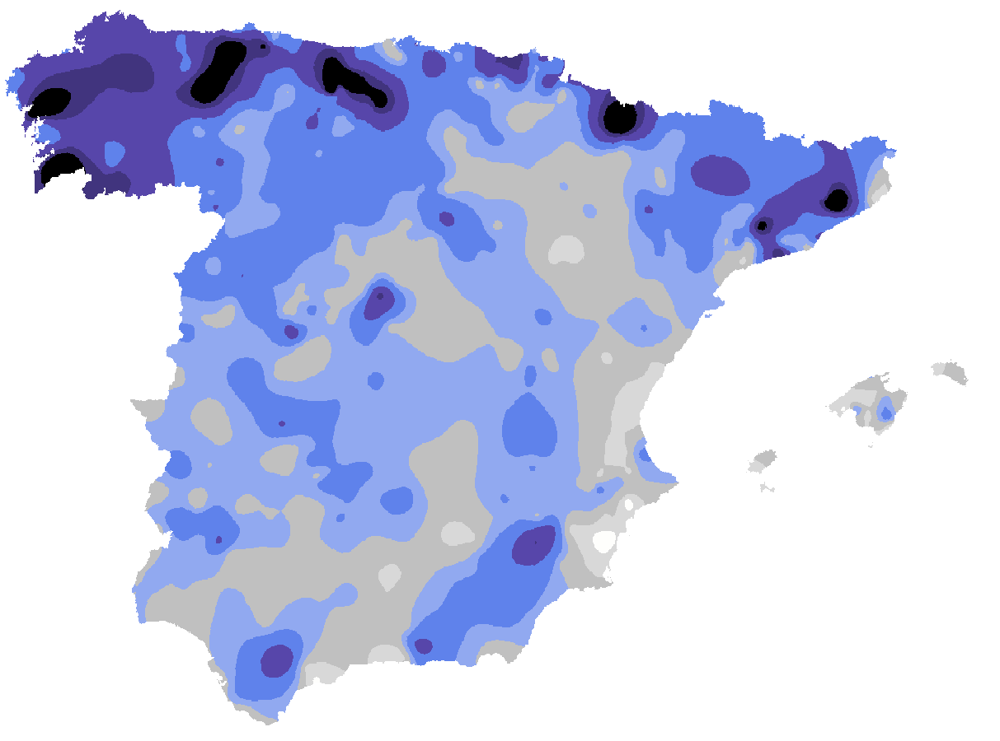

# Introducción

A través de la resolución de este seminario, se pretende adquirir las competencias necesarias para el manejo de datos no estructurados o semiestructurados mediante su obtención, estructuración, manipulación y análisis.

# Objetivo

Nuestro propósito es establecer una relación entre la tasa de cáncer de piel en España en distintas regiones, con diversos factores medioambientales que podrían tener efectos significativos sobre esta patología.

# Metodología

Hemos accedido a distintas fuentes de datos para recopilar información acerca de las horas de sol en España por provincias, así como el índice de radiación UV, las áreas verdes y el número de muertes por cáncer de piel.

## 1. Búsqueda de datos

### MAPAS

**Figura 1:** Nubosidad

**Figura 2:** Horas de insolación

**Figura 3:** Índice de vegetación

## 2. Estructuración y manipulación de los datos

## 3. Análisis de datos

## 4. Comparación
