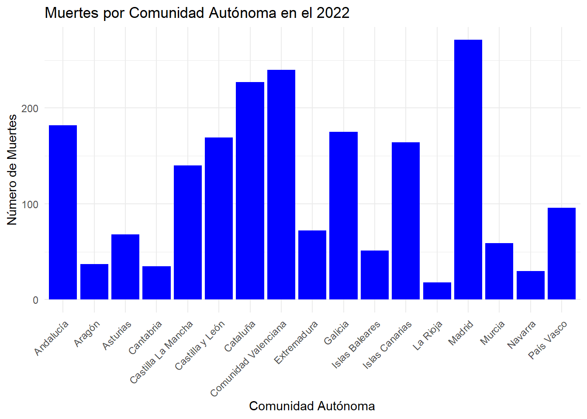
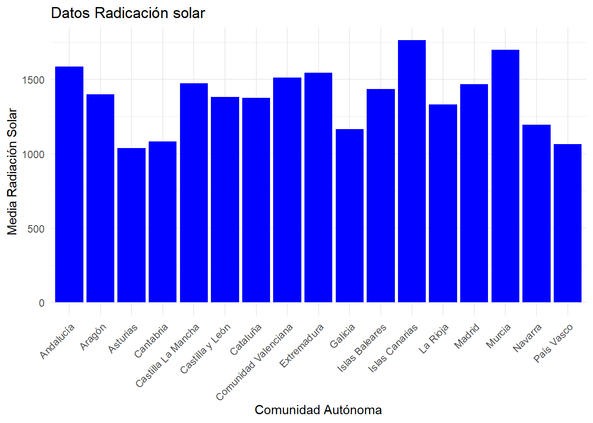
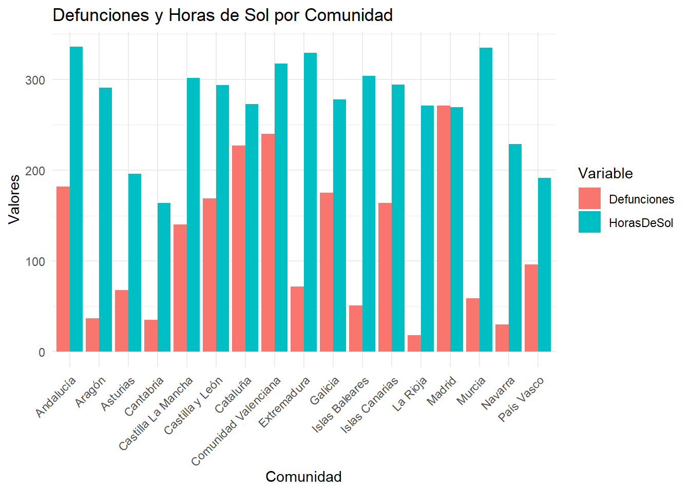
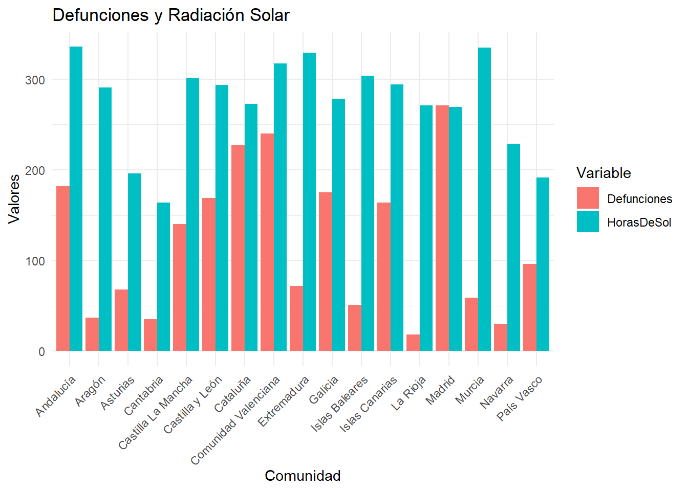
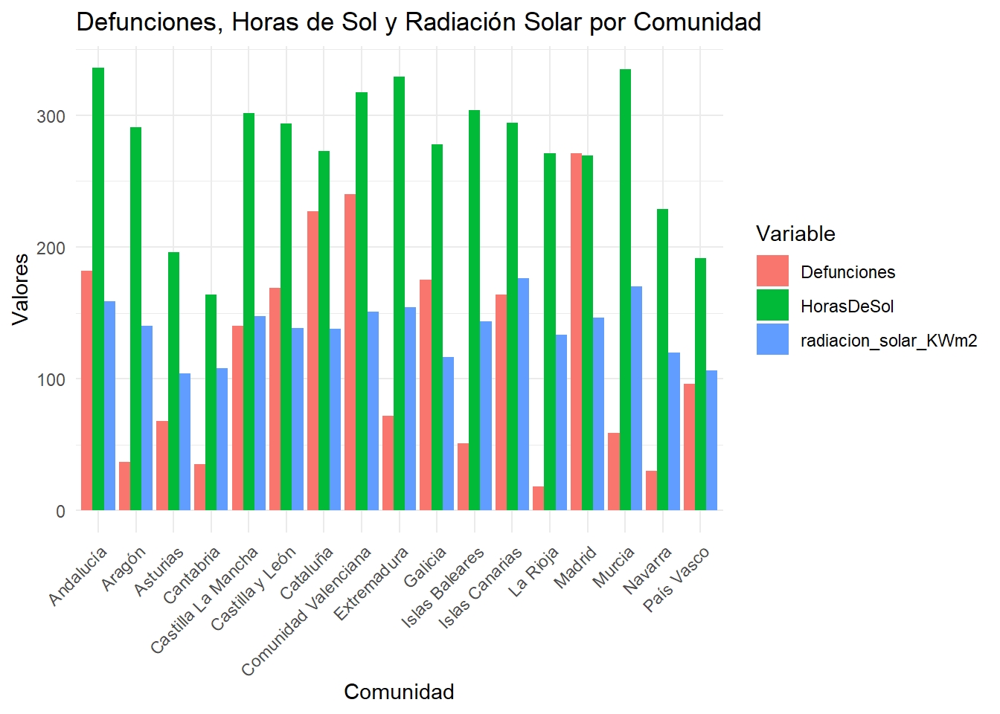

---
title: "Efectos del sol en la tasa de muertes por causa de patologías dermatológicas en España"
author: "Carmen Ruiz Alonso, Anna Lázaro Caminero y Silvia Tobes García"
date: "Curso 2024/25"
output:
  html_document:
    toc: true
    toc_float:
      collapsed: true
      smooth_scroll: true
---

Url del repositorio: https://github.com/alc1020/SEMINARIO_FUENTES \

Integrantes: \
Carmen Ruiz Alonso: cra1009@alu.ubu.es \
Silvia Tobes García: stg1004@alu.ubu.es \
Anna Lázaro Caminero: alc1020@alu.ubu.es \

# Índice de contenidos
1. Resumen \
2. Objetivo \
3. Metodología \
3.1 Búsqueda de datos \
3.2 Estructuración de datos \
4. Análisis de resultados \
5. Conclusión


# 1. Introducción

Durante la resolución de este seminario se pretenderá establecer una relación entre los efectos de los rayos ultravioleta, y las horas de luz en el día y en la muerte causada por cualquier enfermedad de piel a nivel nacional.

Para ello, accederemos a datos relevantes, y los manipularemos para obtener herramientas en el análisis de dicho objetivo. Realizaremos el análisis en R studio, utilizando las bibliotecas/paquetes necesarios en cada momento.

# 2. Objetivo

Defender la integridad de nuestro trabajo frente Antonio Jesús Canepa (https://github.com/ajcanepa).

# 3. Metodología

Hemos accedido a distintas fuentes de datos para recopilar información acerca de las horas de sol en España por provincias, así como el índice de radiación UV y el número de muertes por causa de patologías de piel.

## 3.1 Búsqueda de datos

Comentamos de dónde hemos sacado los datos, y como accedemos a ellos en R studio.

### 3.1.1 Índice anual de muertes por enfermedades de piel por comunidades autónomas
Datos proporcionados por el Instituto Nacional de Estadística que nos indican la cantidad de personas que fallecen debido a patologías cutáneas y subcutáneas anualmente. Están disponibles los datos desde el año 2010 al año 2022.

Para un manejo más eficiente, sólo utilizaremos las del año 2022 en conjunto con los datos aportados por AEMET.


``` r
library(readr)
Defunciones_2022 <- read_delim(file = "INPUT/DATA/defunciones_2022 csv.csv",
                                  delim = ";", escape_double = FALSE, trim_ws = TRUE)
```

```
## Rows: 19 Columns: 3
## ── Column specification ────────────────────────────────────────────────────────
## Delimiter: ";"
## chr (1): Nombre
## dbl (2): ID, Valor
## 
## ℹ Use `spec()` to retrieve the full column specification for this data.
## ℹ Specify the column types or set `show_col_types = FALSE` to quiet this message.
```


### 3.1.2 Variación meteorológica respectiva a radiación solar

Datos csv proporcionados por la empresa especializada en energía MRWATT, relativos a la radiación solar, por su posible relación con la incidencia de mutaciones cutáneas cuando la piel está expuesta cierta intensidad de radiación solar en diferentes zonas de España.


En primer lugar, descargamos las librerías readr y tidyverse que necesitaremos en la estructuración de los datos y su posterior manejo. El siguiente código se corresponde a la obtención, estructuración y visualización de los datos del archivo csv.


``` r
library(readr)
library(tidyverse)
```

```
## ── Attaching core tidyverse packages ──────────────────────── tidyverse 2.0.0 ──
## ✔ dplyr     1.1.4     ✔ purrr     1.0.2
## ✔ forcats   1.0.0     ✔ stringr   1.5.1
## ✔ ggplot2   3.5.1     ✔ tibble    3.2.1
## ✔ lubridate 1.9.3     ✔ tidyr     1.3.1
## ── Conflicts ────────────────────────────────────────── tidyverse_conflicts() ──
## ✖ dplyr::filter() masks stats::filter()
## ✖ dplyr::lag()    masks stats::lag()
## ℹ Use the conflicted package (<http://conflicted.r-lib.org/>) to force all conflicts to become errors
```

``` r
library(dplyr)
library(ggplot2)
library(mapSpain)
```

```
## Warning: package 'mapSpain' was built under R version 4.4.2
```

``` r
library(sf)
```

```
## Linking to GEOS 3.12.1, GDAL 3.8.4, PROJ 9.3.1; sf_use_s2() is TRUE
```

``` r
Radiacion_solar <- read_delim(file = "INPUT/DATA/Radiacion_solar csv.csv",
                           delim = ";", escape_double = FALSE, trim_ws = TRUE)
```

```
## Rows: 52 Columns: 16
## ── Column specification ────────────────────────────────────────────────────────
## Delimiter: ";"
## chr  (1): Localidad
## dbl (15): ENE, FEB, MAR, ABR, MAY, JUN, JUL, AGO, SEP, OCT, NOV, DIC, MJ/m2,...
## 
## ℹ Use `spec()` to retrieve the full column specification for this data.
## ℹ Specify the column types or set `show_col_types = FALSE` to quiet this message.
```

``` r
Radiacion_solar <- Radiacion_solar %>%
  rename (radiacion_solar_KWm2 = KW_por_m2)


str(Radiacion_solar)
```

```
## spc_tbl_ [52 × 16] (S3: spec_tbl_df/tbl_df/tbl/data.frame)
##  $ Localidad           : chr [1:52] "ALAVA" "ALBACETE" "ALICANTE" "ALMERIA" ...
##  $ ENE                 : num [1:52] 151 220 277 291 174 197 213 235 211 165 ...
##  $ FEB                 : num [1:52] 200 306 349 354 222 265 289 311 276 228 ...
##  $ MAR                 : num [1:52] 326 434 472 477 307 391 395 418 375 361 ...
##  $ ABR                 : num [1:52] 357 528 519 539 334 485 514 446 441 440 ...
##  $ MAY                 : num [1:52] 406 584 635 636 414 533 600 577 511 514 ...
##  $ JUN                 : num [1:52] 457 690 680 675 419 612 676 623 559 592 ...
##  $ JUL                 : num [1:52] 498 733 710 696 462 721 711 666 593 631 ...
##  $ AGO                 : num [1:52] 476 639 620 618 407 695 653 566 497 568 ...
##  $ SEP                 : num [1:52] 414 545 530 536 361 546 520 474 422 484 ...
##  $ OCT                 : num [1:52] 275 360 394 404 283 326 355 350 313 292 ...
##  $ NOV                 : num [1:52] 179 274 321 328 192 226 269 276 236 213 ...
##  $ DIC                 : num [1:52] 142 221 265 279 162 181 217 226 202 157 ...
##  $ MJ/m2               : num [1:52] 3881 5534 5772 5833 3737 ...
##  $ radiacion_solar_KWm2: num [1:52] 1078 1537 1603 1620 1038 ...
##  $ KW/m2_2             : num [1:52] 129 184 192 194 125 173 180 172 155 155 ...
##  - attr(*, "spec")=
##   .. cols(
##   ..   Localidad = col_character(),
##   ..   ENE = col_double(),
##   ..   FEB = col_double(),
##   ..   MAR = col_double(),
##   ..   ABR = col_double(),
##   ..   MAY = col_double(),
##   ..   JUN = col_double(),
##   ..   JUL = col_double(),
##   ..   AGO = col_double(),
##   ..   SEP = col_double(),
##   ..   OCT = col_double(),
##   ..   NOV = col_double(),
##   ..   DIC = col_double(),
##   ..   `MJ/m2` = col_double(),
##   ..   KW_por_m2 = col_double(),
##   ..   `KW/m2_2` = col_double()
##   .. )
##  - attr(*, "problems")=<externalptr>
```

``` r
summary(Radiacion_solar)
```

```
##   Localidad              ENE             FEB             MAR       
##  Length:52          Min.   :151.0   Min.   :200.0   Min.   :307.0  
##  Class :character   1st Qu.:178.8   1st Qu.:253.8   1st Qu.:375.0  
##  Mode  :character   Median :208.5   Median :283.0   Median :406.5  
##                     Mean   :219.0   Mean   :286.4   Mean   :410.2  
##                     3rd Qu.:242.0   3rd Qu.:311.8   3rd Qu.:441.0  
##                     Max.   :366.0   Max.   :430.0   Max.   :539.0  
##       ABR             MAY             JUN             JUL       
##  Min.   :322.0   Min.   :402.0   Min.   :419.0   Min.   :444.0  
##  1st Qu.:444.8   1st Qu.:513.8   1st Qu.:582.5   1st Qu.:626.8  
##  Median :488.0   Median :560.0   Median :621.0   Median :672.0  
##  Mean   :476.5   Mean   :553.1   Mean   :609.2   Mean   :657.9  
##  3rd Qu.:516.0   3rd Qu.:600.8   3rd Qu.:671.5   3rd Qu.:713.2  
##  Max.   :590.0   Max.   :707.0   Max.   :735.0   Max.   :805.0  
##       AGO             SEP             OCT             NOV       
##  Min.   :375.0   Min.   :361.0   Min.   :269.0   Min.   :179.0  
##  1st Qu.:557.2   1st Qu.:473.0   1st Qu.:316.5   1st Qu.:221.8  
##  Median :612.5   Median :507.5   Median :339.5   Median :246.0  
##  Mean   :588.0   Mean   :498.4   Mean   :344.3   Mean   :257.8  
##  3rd Qu.:640.2   3rd Qu.:540.5   3rd Qu.:367.0   3rd Qu.:286.2  
##  Max.   :731.0   Max.   :616.0   Max.   :469.0   Max.   :401.0  
##       DIC            MJ/m2      radiacion_solar_KWm2    KW/m2_2     
##  Min.   :142.0   Min.   :3737   Min.   :1038         Min.   :125.0  
##  1st Qu.:169.0   1st Qu.:4783   1st Qu.:1328         1st Qu.:159.5  
##  Median :196.5   Median :5180   Median :1438         Median :173.0  
##  Mean   :211.0   Mean   :5112   Mean   :1420         Mean   :170.4  
##  3rd Qu.:239.2   3rd Qu.:5567   3rd Qu.:1546         3rd Qu.:185.2  
##  Max.   :373.0   Max.   :6582   Max.   :1828         Max.   :219.0
```

``` r
Provs <- esp_get_prov()%>%
  rename("Localidad"=ine.prov.name)

Provs <- Provs %>% 
  mutate(Localidad = case_when(
    Localidad == "Almería" ~ "ALMERIA",
    Localidad == "Cádiz" ~ "CADIZ",
    Localidad == "Araba/Álava" ~ "ALAVA",
    Localidad == "Albacete" ~ "ALBACETE",
    Localidad == "Alicante/Alacant" ~ "ALICANTE",
    Localidad == "Ávila" ~ "AVILA",
    Localidad == "Badajoz" ~ "BADAJOZ",
    Localidad == "Barcelona" ~ "BARCELONA",
    Localidad == "Burgos" ~ "BURGOS",
    Localidad == "Cáceres" ~ "CACERES",
    Localidad == "Cádiz" ~ "CADIZ",
    Localidad == "Cantabria" ~ "CANTABRIA",
    Localidad == "Castellón/Castelló" ~ "CASTELLON",
    Localidad == "Ceuta" ~ "CEUTA",
    Localidad == "Ciudad Real" ~ "CIUDAD REAL",
    Localidad == "Córdoba" ~ "CORDOBA",
    Localidad == "Coruña, A" ~ "LA CORUÑA",
    Localidad == "Cuenca" ~ "CUENCA",
    Localidad == "Girona" ~ "GERONA",
    Localidad == "Granada" ~ "GRANADA",
    Localidad == "Guadalajara" ~ "GUADALAJARA",
    Localidad == "Gipuzkoa" ~ "GUIPUZCOA",
    Localidad == "Huelva" ~ "HUELVA",
    Localidad == "Huesca" ~ "HUESCA",
    Localidad == "Jaén" ~ "JAEN",
    Localidad == "León" ~ "LEON",
    Localidad == "Lleida" ~ "LERIDA",
    Localidad == "Lugo" ~ "LUGO",
    Localidad == "Madrid" ~ "MADRID",
    Localidad == "Málaga" ~ "MALAGA",
    Localidad == "Melilla" ~ "MELILLA",
    Localidad == "Murcia" ~ "MURCIA",
    Localidad == "Navarra" ~ "NAVARRA",
    Localidad == "Ourense" ~ "ORENSE",
    Localidad == "Palencia" ~ "PALENCIA",
    Localidad == "Palmas, Las" ~ "LAS PALMAS",
    Localidad == "Pontevedra" ~ "PONTEVEDRA",
    Localidad == "Salamanca" ~ "SALAMANCA",
    Localidad == "Santa Cruz de Tenerife" ~ "ST.C.TENERIFE",
    Localidad == "Segovia" ~ "SEGOVIA",
    Localidad == "Sevilla" ~ "SEVILLA",
    Localidad == "Soria" ~ "SORIA",
    Localidad == "Tarragona" ~ "TARRAGONA",
    Localidad == "Teruel" ~ "TERUEL",
    Localidad == "Toledo" ~ "TOLEDO",
    Localidad == "Valencia/València" ~ "VALENCIA",
    Localidad == "Valladolid" ~ "VALLADOLID",
    Localidad == "Bizkaia" ~ "VIZCAYA",
    Localidad == "Zamora" ~ "ZAMORA",
    Localidad == "Zaragoza" ~ "ZARAGOZA",
    Localidad == "Asturias" ~ "ASTURIAS",
    Localidad == "Balears, Illes" ~ "BALEARES",
    Localidad == "Rioja, La" ~ "LA RIOJA"
))


provin<-st_as_sf(inner_join(y=Provs, x= Radiacion_solar, by="Localidad"))
provincias <- st_transform(provin,crs=4326)
Can <- esp_get_can_box()
ggplot(provincias) +
  geom_sf(aes(fill =`radiacion_solar_KWm2`),
    color = "grey70",
    linewidth = .3
  ) +
  geom_sf(data = Can, color = "grey70") +
  geom_sf_label(aes(label = `radiacion_solar_KWm2`),
    fill = "white", alpha = 0.5,
    size = 3,
label.size = 0
  ) +
  scale_fill_gradientn(
    colors = hcl.colors(15, "Greens", rev = TRUE),
    n.breaks = 10,
    labels = function(x) {
      sprintf("%1.1f%%", 1 * x)
    },
    guide = guide_legend(title = "radiacion")
  ) +
  theme_void() +
  theme(legend.position = c(0.1, 0.6))
```

```
## Warning: A numeric `legend.position` argument in `theme()` was deprecated in ggplot2
## 3.5.0.
## ℹ Please use the `legend.position.inside` argument of `theme()` instead.
## This warning is displayed once every 8 hours.
## Call `lifecycle::last_lifecycle_warnings()` to see where this warning was
## generated.
```

```
## Warning in st_point_on_surface.sfc(sf::st_zm(x)): st_point_on_surface may not
## give correct results for longitude/latitude data
```


``` r
??geom_sf_label
```

```
## starting httpd help server ... done
```


<<<<<<< HEAD
**Figura 2:** Índice de radiación solar
=======


**Figura 1:** Índice de radiación solar
>>>>>>> e0a5799b83bcc2e67b4ddc384e68791996a325ef


### 3.1.3 Número de horas de sol

Datos csv proporcionados por la empresa de energía renovable y telefonía Roam, acerca del número de horas de sol del que dispone cada provincia en España. Posible relación de la incidencia prolongada del sol con el incremento de patologías en la piel.

PASOS

Primero, importamos las librerías correspondientes, estructuramos el csv y lo mostramos.


``` r
library(readr)
library(tidyverse)

Horas_de_sol <- read_delim(file = "INPUT/DATA/Horas_de_sol csv.csv",
                               delim = ";", escape_double = FALSE, trim_ws = TRUE)
```

```
## Rows: 52 Columns: 3
## ── Column specification ────────────────────────────────────────────────────────
## Delimiter: ";"
## chr (1): Provincia
## dbl (2): HorasDeSol, HSP*
## 
## ℹ Use `spec()` to retrieve the full column specification for this data.
## ℹ Specify the column types or set `show_col_types = FALSE` to quiet this message.
```

``` r
Horas_de_sol
```

```
## # A tibble: 52 × 3
##    Provincia HorasDeSol `HSP*`
##    <chr>          <dbl>  <dbl>
##  1 Almería         3.30   6.02
##  2 Cádiz           3.32   6   
##  3 Córdoba         3.32   5.9 
##  4 Granada         3.33   5.93
##  5 Huelva          3.53   6.02
##  6 Jaén            3.29   5.82
##  7 Málaga          3.25   5.82
##  8 Sevilla         3.53   5.98
##  9 Huesca          3.10   5.67
## 10 Teruel          3.01   5.11
## # ℹ 42 more rows
```

``` r
str(Horas_de_sol)
```

```
## spc_tbl_ [52 × 3] (S3: spec_tbl_df/tbl_df/tbl/data.frame)
##  $ Provincia : chr [1:52] "Almería" "Cádiz" "Córdoba" "Granada" ...
##  $ HorasDeSol: num [1:52] 3.31 3.32 3.32 3.33 3.53 ...
##  $ HSP*      : num [1:52] 6.02 6 5.9 5.93 6.02 5.82 5.82 5.98 5.67 5.11 ...
##  - attr(*, "spec")=
##   .. cols(
##   ..   Provincia = col_character(),
##   ..   HorasDeSol = col_double(),
##   ..   `HSP*` = col_double()
##   .. )
##  - attr(*, "problems")=<externalptr>
```

``` r
summary(Horas_de_sol)
```

```
##   Provincia           HorasDeSol         HSP*      
##  Length:52          Min.   :1.639   Min.   :3.600  
##  Class :character   1st Qu.:2.728   1st Qu.:5.010  
##  Mode  :character   Median :2.953   Median :5.500  
##                     Mean   :2.894   Mean   :5.272  
##                     3rd Qu.:3.284   3rd Qu.:5.740  
##                     Max.   :3.527   Max.   :6.020
```

``` r
view(Horas_de_sol)
```


## 3.2 Estructuración y manipulación de los datos

Después de haber cargado los datos, tenemos que pasarlos a formatos que podamos utilizar para obtener gráficas, tablas adaptadas, etc.


### 3.2.1 Datos Defunciones 

Antes de hacer cualquier tipo de merge, o join para unificar nuestros datos, tenemos que prepararlos para que sean compatibles los datos entre ellos. Para esto tendremos que cambiar de nombre la columna "Nombre" a "Comunidad".


``` r
library(dplyr)
datos_defunciones_2022 <- Defunciones_2022 %>%
  rename(Comunidad = Nombre)%>%
  rename(Defunciones = Valor)
```

Hacemos lo mismo para los nombres de las comunidades autónomas necesarias:


``` r
library(dplyr)
datos_defunciones_2022 <- datos_defunciones_2022 %>%
  mutate(Comunidad = case_when(
    Comunidad == "Asturias, Principado de" ~ "Asturias",
    Comunidad == "Balears, Illes" ~ "Islas Baleares",
    
    Comunidad == "Canarias" ~ "Islas Canarias",
    
    Comunidad == "Castilla - La Mancha" ~ "Castilla La Mancha",
    Comunidad == "Comunitat Valenciana" ~ "Comunidad Valenciana",

    Comunidad == "Madrid, Comunidad de" ~ "Madrid",
    Comunidad == "Murcia, Región de" ~ "Murcia",
    
    Comunidad == "Navarra, Comunidad Foral de" ~ "Navarra",
    Comunidad == "Rioja, La" ~ "La Rioja",
    
    TRUE ~ Comunidad
))
```

Además, usaremos el TRUE ~ Comunidad en caso de que si no fuera necesario, los valores no se cambien.


Finalmente, eliminamos "Ceuta" y "Melilla", no por discriminar, sino porque no se ha encontrado datos relevantes en otro de los ámbitos estudiados y por tanto quedan excluidos actualmente. Procedemos a organizar los datos después del cambio alfabéticamente.


``` r
library(dplyr)
datos_defunciones_2022 <- datos_defunciones_2022 %>%
  filter(!Comunidad %in% c("Ceuta", "Melilla")) %>%
  arrange(Comunidad)
```

Haremos un dataframe, y posteriormente crearemos un gráfico.


``` r
datos_def_dataframe <- data.frame(datos_defunciones_2022)


library(ggplot2)
grafico_defunciones_2022 <- ggplot(datos_def_dataframe, aes(x = Comunidad, y = Defunciones)) +
  geom_bar(stat = "identity", fill = "blue") +
  labs(
    title = "Muertes por Comunidad Autónoma en el 2022",
    x = "Comunidad Autónoma",
    y = "Número de Muertes"
  ) +
  theme_minimal() +
  theme(axis.text.x = element_text(angle = 45, hjust = 1))

grafico_defunciones_2022
```




### 3.2.2 Datos Radiación Solar
Puesto que los datos se encuentran estipulados por provincias, y nosotros queremos que figuren por comunidad autónoma, tendremos que agrupar las provincias que pertenezcan a su respectiva comunidad autónoma, y hacer la media del índice de radiación solar de las mismas.

Para ello, primeramente, hacemos uso de la función case_when para asignar la correspondiente comunidad autónoma a cada provincia. Si no existe ninguna coincidencia, aparecerá un valor nulo NA. Después, con mutate añadimos una nueva columna con las comunidades generadas. Puesto que Ceuta y Melilla son ciudades autónomas que no se van a incluir en el estudio, y por tanto figuran como NA, las descartamos con filter.


``` r
datosrad <- Radiacion_solar %>%
  mutate(
    Comunidad = case_when(
      
      Localidad %in% c("ALMERIA", "CADIZ", "CORDOBA", "GRANADA", "HUELVA", "JAEN", "MALAGA", "SEVILLA") ~ "Andalucía",
      Localidad %in% c("HUESCA", "ZARAGOZA", "TERUEL") ~ "Aragón",
      Localidad %in% c("ASTURIAS") ~ "Asturias",
      Localidad %in% c("CANTABRIA") ~ "Cantabria",
      Localidad %in% c("TOLEDO", "CIUDAD REAL", "GUADALAJARA", "CUENCA", "ALBACETE") ~ "Castilla La Mancha",
      Localidad %in% c("LEON", "ZAMORA", "SALAMANCA", "PALENCIA", "VALLADOLID", "AVILA", "BURGOS", "SORIA", "SEGOVIA") ~ "Castilla y León",
      Localidad %in% c("LERIDA", "GERONA", "BARCELONA", "TARRAGONA") ~ "Cataluña",
      Localidad %in% c("CASTELLON", "VALENCIA", "ALICANTE") ~ "Comunidad Valenciana",
      Localidad %in% c("CACERES", "BADAJOZ") ~ "Extremadura",
      Localidad %in% c("LUGO", "ORENSE", "PONTEVEDRA", "LA CORUÑA") ~ "Galicia",
      Localidad %in% c("BALEARES") ~ "Islas Baleares",
      Localidad %in% c("ST.C.TENERIFE", "LAS PALMAS") ~ "Islas Canarias",
      Localidad %in% c("LA RIOJA") ~ "La Rioja",
      Localidad %in% c("MADRID") ~ "Madrid",
      Localidad %in% c("MURCIA") ~ "Murcia",
      Localidad %in% c("NAVARRA") ~ "Navarra",
      Localidad %in% c("ALAVA", "VIZCAYA", "GUIPUZCOA") ~ "País Vasco",
      
      TRUE ~ NA_character_
    ))%>%
  
  filter(!is.na(Comunidad))
```

A continuación, hacemos la media de los índices anuales de radiación solar en unidades de KW/m2, agrupados por comunidades.


``` r
mediarad <- datosrad %>%
  group_by(Comunidad) %>%
  summarise(radiacion_solar_KWm2 = mean(radiacion_solar_KWm2))
```

Finalmente, creamos un dataframe con los datos resultantes que vamos a analizar, y creamos un gráfico de barras con el índice de radiación por comunidad.


``` r
datos_radiacion_solar <- data.frame(
  c(mediarad)
)

print(datos_radiacion_solar)
```

```
##               Comunidad radiacion_solar_KWm2
## 1             Andalucía             1585.625
## 2                Aragón             1400.333
## 3              Asturias             1038.000
## 4             Cantabria             1081.000
## 5    Castilla La Mancha             1474.400
## 6       Castilla y León             1382.111
## 7              Cataluña             1376.750
## 8  Comunidad Valenciana             1510.667
## 9           Extremadura             1543.500
## 10              Galicia             1166.500
## 11       Islas Baleares             1436.000
## 12       Islas Canarias             1762.000
## 13             La Rioja             1331.000
## 14               Madrid             1466.000
## 15               Murcia             1699.000
## 16              Navarra             1196.000
## 17           País Vasco             1064.333
```

``` r
#ggplot(data = datos_radiacion_solar, aes(x = Comunidad, y = KW_por_m2)) +
 # geom_bar(stat = "identity")


grafico_datos_radiacion_solar <- ggplot(data = datos_radiacion_solar, aes(x = Comunidad, 
                                                                          y = radiacion_solar_KWm2)) +
  geom_bar(stat = "identity", fill = "blue") +
  labs(
    title = "Datos Radicación solar",
    x = "Comunidad Autónoma",
    y = "Media Radiación Solar"
  ) +
  theme_minimal() +
  theme(axis.text.x = element_text(angle = 45, hjust = 1))

grafico_datos_radiacion_solar
```




### 3.2.3 Datos Horas de Sol

Seguidamente, asignamos a cada provincia su comunidad autónoma, creando una nueva columna.Aquellos nombres que no pertenezcan a ninguna comunidad aparecerán como nulos (NA). En este caso no hay ninguno, pero si lo hubiera, se eliminaría con filter.


``` r
datos <- Horas_de_sol %>%
  mutate(
    Comunidad = case_when(
      
      Provincia %in% c("Almería", "Cádiz", "Córdoba", "Granada", "Huelva", "Jaén", "Málaga", "Sevilla") ~ "Andalucía",
      Provincia %in% c("Huesca", "Zaragoza", "Teruel") ~ "Aragón",
      Provincia %in% c("Asturias") ~ "Asturias",
      Provincia %in% c("Cantabria") ~ "Cantabria",
      Provincia %in% c("Toledo", "Ciudad Real", "Guadalajara", "Cuenca", "Albacete") ~ "Castilla La Mancha",
      Provincia %in% c("León", "Zamora", "Salamanca", "Palencia", "Valladolid", "Ávila", "Burgos", "Soria", "Segovia") ~ "Castilla y León",
      Provincia %in% c("Lleida", "Girona", "Barcelona", "Tarragona") ~ "Cataluña",
      Provincia %in% c("Castellón", "Valencia", "Alicante") ~ "Comunidad Valenciana",
      Provincia %in% c("Cáceres", "Badajoz") ~ "Extremadura",
      Provincia %in% c("Lugo", "Ourense", "Pontevedra", "A Coruña") ~ "Galicia",
      Provincia %in% c("Menorca", "Mallorca") ~ "Islas Baleares",
      Provincia %in% c("Tenerife", "La Palma", "Lanzarote") ~ "Islas Canarias",
      Provincia %in% c("La Rioja") ~ "La Rioja",
      Provincia %in% c("Madrid") ~ "Madrid",
      Provincia %in% c("Murcia") ~ "Murcia",
      Provincia %in% c("Pamplona") ~ "Navarra",
      Provincia %in% c("Álava", "Vizcaya", "Guipúzcoa") ~ "País Vasco",

      TRUE ~ NA_character_
    ))%>%

  filter(!is.na(Comunidad))
```


Mediante el uso de group_by y summarise, hacemos la media de las horas de sol de las provincias, agrupadas por comunidad autónoma.


``` r
medias <- datos %>%
  group_by(Comunidad) %>%
  summarise(HorasDeSol = mean(HorasDeSol))

print(medias)
```

```
## # A tibble: 17 × 2
##    Comunidad            HorasDeSol
##    <chr>                     <dbl>
##  1 Andalucía                  3.36
##  2 Aragón                     2.91
##  3 Asturias                   1.96
##  4 Cantabria                  1.64
##  5 Castilla La Mancha         3.01
##  6 Castilla y León            2.94
##  7 Cataluña                   2.73
##  8 Comunidad Valenciana       3.18
##  9 Extremadura                3.29
## 10 Galicia                    2.78
## 11 Islas Baleares             3.04
## 12 Islas Canarias             2.94
## 13 La Rioja                   2.71
## 14 Madrid                     2.69
## 15 Murcia                     3.35
## 16 Navarra                    2.28
## 17 País Vasco                 1.92
```


Para terminar, visualizamos los datos finales en un dataframe y en un gráfico de barras.


``` r
datos_horas_de_sol <- data.frame(
  c(medias)
)

grafico_horas_de_sol <- ggplot(data = datos_horas_de_sol, aes(x = Comunidad, y = HorasDeSol)) +
  geom_bar(stat = "identity", fill = "blue") +
  labs(
    title = "Horas de Sol por Comunidad Autónoma",
    x = "Comunidad Autónoma",
    y = "Horas de sol"
  ) +
  theme_minimal() +
  theme(axis.text.x = element_text(angle = 45, hjust = 1))

grafico_horas_de_sol
```


# 4. Análisis de los resultados

Visualizamos los datos obtenidos, en nuestro caso hemos optado por el uso de gráficas como medio de expresión.

## 4.1 Comparación defunciones y horas de sol

Para la comparación de defunciones y horas de sol, hemos optado por multiplicar las horas de sol por 100, con la finalidad de poder ver mejor la proporción entre muertes y horas de sol.

Usamos merge() para juntar las tablas de los datos que necesitamos, usando como lazo común la columna "Comunidad".Después, usamos pivot_longer para poder conseguir dos filas por cada comunidad, una con el valor de las horas de sol, y otra con las defunciones. 

Por último usamos ggplot para crear el gráfico.


``` r
library(ggplot2)
datos_defunciones_2022
```

```
## # A tibble: 17 × 3
##       ID Comunidad            Defunciones
##    <dbl> <chr>                      <dbl>
##  1  8997 Andalucía                    182
##  2  8998 Aragón                        37
##  3  8999 Asturias                      68
##  4  9002 Cantabria                     35
##  5  9004 Castilla La Mancha           140
##  6  9003 Castilla y León              169
##  7  9005 Cataluña                     227
##  8  9006 Comunidad Valenciana         240
##  9  9007 Extremadura                   72
## 10  9008 Galicia                      175
## 11  9000 Islas Baleares                51
## 12  9001 Islas Canarias               164
## 13  9013 La Rioja                      18
## 14  9009 Madrid                       271
## 15  9010 Murcia                        59
## 16  9011 Navarra                       30
## 17  9012 País Vasco                    96
```

``` r
datos_horas_de_sol
```

```
##               Comunidad HorasDeSol
## 1             Andalucía   3.356875
## 2                Aragón   2.910000
## 3              Asturias   1.962000
## 4             Cantabria   1.639000
## 5    Castilla La Mancha   3.014200
## 6       Castilla y León   2.935556
## 7              Cataluña   2.726000
## 8  Comunidad Valenciana   3.175333
## 9           Extremadura   3.294500
## 10              Galicia   2.776000
## 11       Islas Baleares   3.039500
## 12       Islas Canarias   2.940667
## 13             La Rioja   2.708000
## 14               Madrid   2.691000
## 15               Murcia   3.348000
## 16              Navarra   2.285000
## 17           País Vasco   1.915667
```

``` r
datos_horas_de_sol$HorasDeSol <- datos_horas_de_sol$HorasDeSol*100 

datos_horas_sol_def <- merge(datos_defunciones_2022, datos_horas_de_sol, by = "Comunidad")
datos_horas_sol_def
```

```
##               Comunidad   ID Defunciones HorasDeSol
## 1             Andalucía 8997         182   335.6875
## 2                Aragón 8998          37   291.0000
## 3              Asturias 8999          68   196.2000
## 4             Cantabria 9002          35   163.9000
## 5    Castilla La Mancha 9004         140   301.4200
## 6       Castilla y León 9003         169   293.5556
## 7              Cataluña 9005         227   272.6000
## 8  Comunidad Valenciana 9006         240   317.5333
## 9           Extremadura 9007          72   329.4500
## 10              Galicia 9008         175   277.6000
## 11       Islas Baleares 9000          51   303.9500
## 12       Islas Canarias 9001         164   294.0667
## 13             La Rioja 9013          18   270.8000
## 14               Madrid 9009         271   269.1000
## 15               Murcia 9010          59   334.8000
## 16              Navarra 9011          30   228.5000
## 17           País Vasco 9012          96   191.5667
```

``` r
datos_horas_sol_def_largo <- datos_horas_sol_def %>%
  pivot_longer(cols = c(Defunciones, HorasDeSol), 
               names_to = "Variable", 
               values_to = "Valor")


grafico_horas_sol_def <- ggplot(datos_horas_sol_def_largo, aes(x = Comunidad, y = Valor, fill = Variable)) +
  geom_bar(stat = "identity", position = "dodge") +
  labs(title = "Defunciones y Horas de Sol por Comunidad",
       x = "Comunidad",
       y = "Valores",
       fill = "Variable") +
  theme_minimal() +
  theme(axis.text.x = element_text(angle = 45, hjust = 1)) 

grafico_horas_sol_def
```


 
Para considerar que estén relacionados, a medida de que crezca el número de muertes tendría que aumentar simultáneamente el valor de horas de sol. 

Como podemos observar, esto no ocurre en el gráfico. En principio, diríamos que no tienen relación causal.

## 4.2 Comparación defunciones y radiación solar
Para comparar las defunciones con la radiación solar, para que se vean mejor las gráficas se ha optado por dividir los datos de radiacion solar entre 10.

Usamos de nuevo el metodo merge para unir ambos datos en una mmisma tabla y luego con ggplot2 observamos los datos con un gráfico de barras para poder sacar una conclusión.


``` r
datos_radiacion_solar$radiacion_solar_KWm2 <- datos_radiacion_solar$radiacion_solar_KWm2 /10
union_rad_def <- merge (datos_defunciones_2022, datos_radiacion_solar, by= "Comunidad")
union_rad_def
```

```
##               Comunidad   ID Defunciones radiacion_solar_KWm2
## 1             Andalucía 8997         182             158.5625
## 2                Aragón 8998          37             140.0333
## 3              Asturias 8999          68             103.8000
## 4             Cantabria 9002          35             108.1000
## 5    Castilla La Mancha 9004         140             147.4400
## 6       Castilla y León 9003         169             138.2111
## 7              Cataluña 9005         227             137.6750
## 8  Comunidad Valenciana 9006         240             151.0667
## 9           Extremadura 9007          72             154.3500
## 10              Galicia 9008         175             116.6500
## 11       Islas Baleares 9000          51             143.6000
## 12       Islas Canarias 9001         164             176.2000
## 13             La Rioja 9013          18             133.1000
## 14               Madrid 9009         271             146.6000
## 15               Murcia 9010          59             169.9000
## 16              Navarra 9011          30             119.6000
## 17           País Vasco 9012          96             106.4333
```

``` r
union_rad_def_largo <- union_rad_def %>%
  pivot_longer(cols = c(Defunciones, radiacion_solar_KWm2), 
               names_to = "Variable", 
               values_to = "Valor")


grafico_union_rad_def <- ggplot(datos_horas_sol_def_largo, aes(x = Comunidad, y = Valor, fill = Variable)) +
  geom_bar(stat = "identity", position = "dodge") +
  labs(title = "Defunciones y Radiación Solar",
       x = "Comunidad",
       y = "Valores",
       fill = "Variable") +
  theme_minimal() +
  theme(axis.text.x = element_text(angle = 45, hjust = 1)) 

grafico_union_rad_def
```



Deberíamos ver una relación proporcional, tal que, cuantas mas defunciones por cáncer de piel mas radiación debería haber.
Pero, como podemos ver en el gráfico esta relación esperada no se ve.

## 4.3 Comparación defunciones, radiación y horas de luz

Para comparar los tres tipos de datos y graficarlos, hacemos uso de la librería ggplot2.

Partiendo de las comparaciones anteriores, aseguramos que los datos se encuentren en la misma escala y los unimos con merge al conjunto de datos principal, por la clave Comunidad.


``` r
library(ggplot2)

datos_completo <- merge(datos_defunciones_2022, datos_horas_de_sol, by = "Comunidad")
datos_completo <- merge(datos_completo, datos_radiacion_solar, by = "Comunidad")

datos_completo
```

```
##               Comunidad   ID Defunciones HorasDeSol radiacion_solar_KWm2
## 1             Andalucía 8997         182   335.6875             158.5625
## 2                Aragón 8998          37   291.0000             140.0333
## 3              Asturias 8999          68   196.2000             103.8000
## 4             Cantabria 9002          35   163.9000             108.1000
## 5    Castilla La Mancha 9004         140   301.4200             147.4400
## 6       Castilla y León 9003         169   293.5556             138.2111
## 7              Cataluña 9005         227   272.6000             137.6750
## 8  Comunidad Valenciana 9006         240   317.5333             151.0667
## 9           Extremadura 9007          72   329.4500             154.3500
## 10              Galicia 9008         175   277.6000             116.6500
## 11       Islas Baleares 9000          51   303.9500             143.6000
## 12       Islas Canarias 9001         164   294.0667             176.2000
## 13             La Rioja 9013          18   270.8000             133.1000
## 14               Madrid 9009         271   269.1000             146.6000
## 15               Murcia 9010          59   334.8000             169.9000
## 16              Navarra 9011          30   228.5000             119.6000
## 17           País Vasco 9012          96   191.5667             106.4333
```

En último lugar,configuramos correctamente la salida de los datos y creamos la gráfica con los tres tipos de datos para su posterior comparación.


``` r
datos_completo_largo <- datos_completo %>%
  pivot_longer(cols = c(Defunciones, HorasDeSol, radiacion_solar_KWm2), 
               names_to = "Variable", 
               values_to = "Valor")

grafico_completo <- ggplot(datos_completo_largo, aes(x = Comunidad, y = Valor, fill = Variable)) +
  geom_bar(stat = "identity", position = "dodge") +
  labs(title = "Defunciones, Horas de Sol y Radiación Solar por Comunidad",
       x = "Comunidad",
       y = "Valores",
       fill = "Variable") +
  theme_minimal() +
  theme(axis.text.x = element_text(angle = 45, hjust = 1))

grafico_completo
```



El análisis de resultados muestra que el índice de radiación solar guarda relación directa con el número de horas de sol. Sin embargo y como se ha comprobado en el punto 4.1, el número de horas de sol y las defunciones no parecen guardar correlación entre ellas.
La cantidad de radiación y el número de defunciones parecen ser proporcionales en muchos casos, pero no podemos asegurar que exista una relación completamente fiable.

# 5. Conculsión

Si nos basamos únicamente en la correlación entre defunciones y horas de sol, concluimos que no hay relación.

Si nos basamos únicamente en la correlación entre defunciones y índice de radiación, concluimos que tampoco existe una relación clara entre las defunciones por causas dermatológicas y la radiación solar .


Teniendo todo en cuenta, concluimos que no podemos afirmar que exista una correlación suficientemente fuerte, para decir que estas variables estén vinculadas.


# 6. Referencias

- Apuntes proporcionados por el profesor
- r-charts.com
- rpubs.com
- ggplot2.tidyverse.org
- opensciencelabs.org
